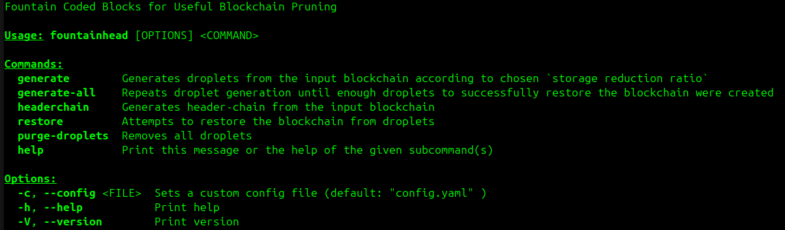

# Fountainhead*

## Fountain Coded Blocks for Useful Bitcoin Blockchain Pruning

*no association with [Ayn Rand][Rand]

SeF: A Secure Fountain Architecture for Slashing Storage Costs in Bitcoin Blockchain

Pruned nodes are nodes that do not store the full archival history of bitcoin blocks. So whilst a pruned node is useful because it can still enforce the rules of the system (i.e. validate and relay new blocks and transactions), the only thing it currently cannot do is serve a complete copy of the blockchain to new nodes joining the network.

**This tool allows nodes to prune data, yet still assist in initial block download of new nodes**. The idea is based on the following paper: [https://arxiv.org/pdf/1906.12140][paper].

The architecture is based on [**fountain codes**][FC], a class of erasure codes, that enable any full node to _encode_ validated blocks into a small number of _coded blocks_, thereby reducing its storage costs by orders of magnitude. The main property that is required of a fountain code is that it should be possible to recover the _k_ input symbols from any set of _K_ (≥ _k_) output symbols with high probability. The parameter _K_ is desired to be very close to _k_.

**Secure Fountain (SeF) architecture** can achieve a _near optimal_ trade-off between the storage savings per node and the bootstrap cost in terms of the number of (honest) storage-constrained nodes a new node needs to contact to recover the entire blockchain. A key technical innovation in SeF codes is to make fountain codes secure against adversarial nodes that can provide maliciously formed coded blocks. The main idea is to use the _header-chain as a side-information_ to check whether a coded block is maliciously formed while it is getting decoded. Further, the _rateless property_ of fountain codes helps in achieving high decentralization and scalability (every node useful for bootstrapping a new node).

SeF architecture blockchain network consisting of _droplet nodes_ with low storage resources. Every droplet node independently encodes validated blocks into a small number of _droplets_ (i.e., coded blocks) using a fountain code, thereby requiring significantly less storage space.

During bootstrap, a new node, called a _bucket node_, acts like a bucket, and collects sufficiently many droplets by contacting any arbitrary subset of droplet nodes (hence, the terms droplets and droplet nodes, as any droplet is as useful as the other), and recovers the blockchain even when some droplet nodes are adversarial, providing murky (malicious) droplets. After validating the blockchain, a bucket node will perform encoding the blockchain into droplets to turn itself into a droplet node.

## Architecture

**Encoding:** Droplet nodes compute droplets in epochs, where an **epoch** is defined as the time required for the blockchain to grow by k blocks (e.g., _k_ = 10000). In the current epoch, when the blockchain grows by _k_ blocks, the sub-chain of length _k_ is encoded into _s_ droplets i.e., coded blocks (e.g., _s_ = 10). Then, the encoding process continues to the next epoch. We perform encoding using a [Luby transfrom code][LT] (a particular kind of fountain encoding, using [robust soliton distribution][soliton] to determine [degree distribution][degree] to randomly sample blocks* that will be encoded into droplet using XOR operation).

*To handle variability in block size and further reduce bandwidth overhead, we concatenate more blocks to form **super-blocks** of approximately same size and then perform encoding on the super-blocks rather than single blocks.

**Decoding:** The bucket node first contacts an arbitrary subset of _n_ droplet nodes (of sufficient size), and collects (downloads) their droplets for previous epochs. Then it uses _error-resilient peeling decoder_ to decode the super-blocks from the collected droplets. For detailed process refer to [the referenced paper][paper].

The classical peeling decoder for LT always accepts a decoded droplet, whereas the error-resilient peeling decoder will accept a decoded droplet only if all of the headers and Merkle roots of blocks encoded in the droplet match the ones stored in the header-chain.

We can assume that a bucket node has an access to the honest (correct) header-chain, because it is easy for a bucket node to obtain the correct header chain (SPV nodes do that routinely). A bucket node can simply query a large number of droplet nodes to obtain the longest valid header-chain.

The bucket node also downloads the uncoded blocks for the current (unfinished) epoch from one or more of the _n_ droplet nodes.

## Usage

Prerequisites:

* Installed [Rust][rust].
* [Signet][signet] bitcoin blockchain.

Run `cargo build --release` to build the app

Run `./target/release/fountainhead help` to get all available commands.

Note: Configuration options (epoch length, storage reduction ratio, directories etc.) must be placed in YAML config file, default file name is `config.yaml`, see provided [template](config.template.yaml).

_From the point of view of droplet node:_

`./target/release/fountainhead generate` Encodes blocks to _s_ droplets.

_From the point of view of bucket node:_

`./target/release/fountainhead generate-all` Generates enough droplets for successful blockchain restoration by repeating the command above. This basically simulates downloading different droplets from different droplet nodes.

`./target/release/fountainhead headerchain` Generates header-chain. This corresponds to downloading valid (longest) header-chain.

`./target/release/fountainhead restore` Attempts to restore the original blockchain from droplets. In case of failure, just call `generate` command. This corresponds to downloading few more droplets.

## Limitations

* Used [rust-bitcoinkernel][rust-bitcoinkernel] is a wrapper around [libbitcoinkernel][libbitcoinkernel], an experimental C++ library exposing Bitcoin Core's validation engine. It's API may change as Bitcoin Core evolves and it has some limitations at the moment:

  * Although it allows to generate header-chain, it lacks the support for querying or traversing it. I had to use LevelDB API to directly access the stored header-chain.

  * While decoding droplet we should also compute and check if Merkle root of the block matches the Merkle root stored in header-chain, but `rust-bitcoinkernel` does not currently provide method to access Merkle root. We can only check if the block hash is part of header-chain and check that blocks are in correct order, ie. previous hash points to the correct predecessor. Invalid block will surely be rejected eventually, but we should reject the invalid droplet during decoding.

* It seems that there is no way for droplet node to be sure that decoded super-block contains all the correct blocks it is supposed to contain. The research [paper][paper] assumes that header-chain contains block sizes, which is not the case!!! If it was true, than surely the bucket node would know what blocks are supposed to be concatenated together in any superblock. This is huge flaw in super-block validation. Is there any possibility to provide this hint to bucket node in a decentralized and inherently adversarial environment?

* The app was tested on Signet, which is relatively short and allows for encoding only around 1400 super-blocks (of 6 MB size) per epoch, which gives us an overhead of 1849 (1.32 times more) necessary droplets for successful decoding. **Longer epochs allow for much smaller overhead**, 10 000 super-blocks long epoch needs 11 396 droplets (only 1.13 times more).

Note: I determined the default parameters for my degree distribution for encoder (robust soliton distribution) experimentally and checked the correctness of the results with values published in [another paper][paper2].

[Rand]: https://en.wikipedia.org/wiki/The_Fountainhead
[paper]: https://arxiv.org/pdf/1906.12140
[signet]: https://en.bitcoin.it/wiki/Signet
[FC]: https://en.wikipedia.org/wiki/Fountain_code
[LT]: https://en.wikipedia.org/wiki/Luby_transform_code
[soliton]: https://en.wikipedia.org/wiki/Soliton_distribution#Robust_distribution
[degree]: https://en.wikipedia.org/wiki/Degree_distribution
[rust]: https://rust-lang.org/
[libbitcoinkernel]: https://github.com/bitcoin/bitcoin/issues/27587
[rust-bitcoinkernel]: https://docs.rs/bitcoinkernel
[paper2]: https://docs.switzernet.com/people/emin-gabrielyan/060112-capillary-references/ref/MacKay05.pdf
